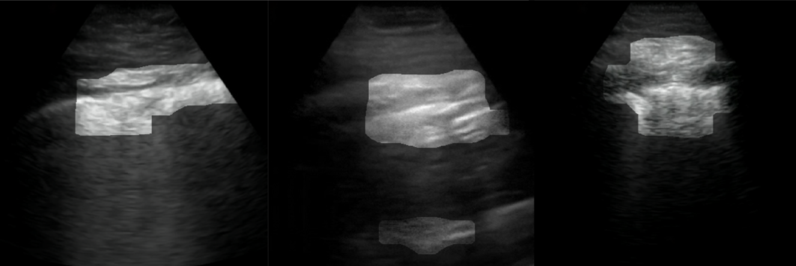
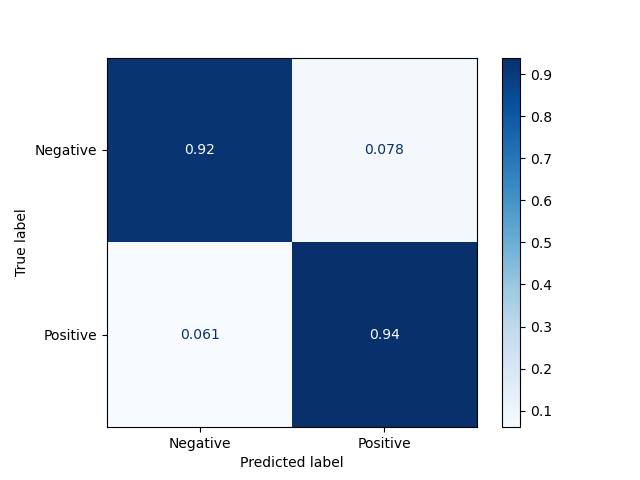

# COVID-Net Open Source Initiative - COVID-Net-US

**Note: The COVID-Net-US models provided here [as part of the COVID-Net Initiative](http://www.covid-net.ml) are intended to be used as reference models that can be built upon and enhanced as new data becomes available. They are currently at a research stage and not yet intended as production-ready models (i.e., not meant for direct clinical diagnosis), and we are working continuously to improve them as new data becomes available. Please do not use COVID-Net-US for self-diagnosis and seek help from your local health authorities.**

<p align="center">
	
	<br>
	<em>Example Ultrasound frames of COVID-19 cases and their associated critical factors (highlighted in white) as identified by GSInquire.</em>
</p>

Since the beginning of 2020, the Coronavirus Disease 2019 (COVID-19) pandemic has had an enormous impact on global healthcare systems, and there has not been a region or domain that has not felt its impact in one way or another. While vaccination efforts have certainly been shown as effective in mitigating further spread of COVID-19, screening of individuals to test for the disease is still necessary to ensure the safety of public health, and the gold-standard of this screening is reverse transcriptase-polymerase chain reaction (RT-PCR). With RT-PCR being laborious and time-consuming, much work has gone into the development of other possible screening tools, namely using chest x-ray (CXR) and computed tomography (CT) imaging modalities to observe abnormalities in images, and extending from needing to have radiologists analyze the images and make diagnoses to using automated models to screen for the presence of COVID-19. Another imaging modality that is gaining traction as a tool for treating lung related diseases is the lung point-of-care ultrasound (POCUS), and has been suggested as most useful in contexts that are resource limited, such as emergency settings or low-resource countries. POCUS devices allow for easier and quicker applications than CXR and CT systems, and are much cheaper to acquire leading to more access in a variety of point-of-care locations, thus enhancing the ability for possible COVID-19 screening.

Motivated by this challenge, this study introduces COVID-Net-US, a novel, highly customized self-attention deep neural network architecture tailored specifically for the detection of COVID-19 cases from POCUS images.  The goal with COVID-Net US is to design a highly efficient yet high performing deep neural network architecture that is small enough to be implemented on low-cost devices allowing for limited additional resources needed when used with POCUS devices in low-resource environments. More specifically, we employ a collaborative human-machine design approach. We leverage human knowledge and experience to design an initial prototype network architecture. This prototype is subsequently leveraged alongside a set of operational requirements catered around low-power, real-time embedded scenarios to generate a unique, highly customized deep neural network architecture tailored for COVID-19 case detection from POCUS images via an automatic machine driven design exploration strategy. This combination of human and machine driven design strategy results in a highly accurate yet efficient network architecture. To advocate affordable healthcare and artificial intelligence for resource-constrained environments, we have made COVID-Net-US open source and publicly available as part of the [COVID-Net Initiative](http://www.covid-net.ml).

COVID-Net-US is built using the dataset prepared by the [COVID-US](https://github.com/nrc-cnrc/COVID-US) open-source open-access initiative maintained by members of the National Research Council Canada and the Vision and Image Processing Research Group, University of Waterloo, Canada. See that repository, or the associated [paper](https://arxiv.org/abs/2103.10003), for further description of the collection and processing of the data, as well as the licenses of each set of data.

For a detailed description of the methodology behind COVID-Net-US, please read the [paper](https://arxiv.org/abs/2108.03131).

Our desire is to encourage broad adoption and contribution to this project. Accordingly this project has been licensed under the GNU Affero General Public License 3.0. Please see license file for terms. If you would like to discuss alternative licensing models, please reach out to us at alex.maclean@uwaterloo.ca and a28wong@uwaterloo.ca or alex@darwinai.ca.

If you are a researcher or healthcare worker and you would like access to the **GSInquire tool to use to interpret COVID-Net-US results** on your data or existing data, please reach out to a28wong@uwaterloo.ca or alex@darwinai.ca.

If there are any technical questions after the README, FAQ, and past/current issues have been read, please post an issue or contact:

* alex.maclean@uwaterloo.ca

If you find our work useful for your research, please cite:

```
@inproceedings{MacLean2021,
  author={MacLean, Alexander, and Abbasi, Saad, and Ebadi, Ashkan, and Zhao, Andy, and Pavlova, Maya, and Gunraj, Hayden, and Xi, Pengcheng, and Kohli, Sonny, and Wong, Alexander},
  title={COVID-Net US: A Tailored, Highly Efficient, Self-Attention Deep Convolutional Neural Network Design for Detection of COVID-19 Patient Cases from Point-of-care Ultrasound Imaging},
  year={2021},
  booktitle={FAIR-MICCAI'21},
  url={https://arxiv.org/abs/2108.03131}
}
```

## Core COVID-Net Team
* DarwinAI Corp., Canada and Vision and Image Processing Research Group, University of Waterloo, Canada
  * Linda Wang
  * Alexander Wong
  * Zhong Qiu Lin
  * Paul McInnis
  * Audrey Chung
  * Melissa Rinch
  * Maya Pavlova
  * Naomi Terhljan
  * Siddharth Surana
  * Hayden Gunraj, [COVID-Net for CT](https://github.com/haydengunraj/COVIDNet-CT)
  * Jeffer Peng, [COVIDNet UI](https://github.com/darwinai/covidnet_ui)
* Vision and Image Processing Research Group, University of Waterloo, Canada
  * James Lee
  * Hossein Aboutalebi
  * Alexander MacLean, [COVID-Net-US](https://github.com/maclean-alexander/COVID-Net-US)
  * Saad Abbasi
* Ashkan Ebadi and Pengcheng Xi (National Research Council Canada)
* Kim-Ann Git (Selayang Hospital)
* Abdul Al-Haimi, [COVID-19 ShuffleNet Chest X-Ray Model](https://github.com/aalhaimi/covid-net-cxr-shuffle)
* Dr. Ali Sabri (Department of Radiology, Niagara Health, McMaster University, Canada)

## Table of Contents
1. [Requirements to install on your system](#requirements)
2. [How to download and prepare the COVID-US dataset](#downloading-the-dataset)
3. [Steps for training, evaluation and inference](docs/train_eval_inference.md)
4. [Results](#results)
5. [Links to pretrained models](docs/models.md)
6. [Licenses and acknowledgements for the datasets used](https://github.com/nrc-cnrc/COVID-US#data-sources-license)

## Requirements
The important requirements are listed below (tested at given versions):
* Tensorflow 1.15
* OpenCV 4.1.1
* Python 3.7.9
* Numpy
* Scikit-Learn
* Matplotlib

## Downloading the Dataset

To generate the dataset, follow the instructions located at [the COVID-US repository](https://github.com/nrc-cnrc/COVID-US#how-to-generate-the-covidx-us-dataset). Running the create_COVIDxUS.ipynb Python notebook will perform all the downloading and processing of the images, resulting in the cleaned dataset located at data/images/clean in that directory.

Dataset splits are defined [in that repository here](https://github.com/nrc-cnrc/COVID-US/tree/main/labels). If you are using a different version of the dataset than the default here (at the moment, COVID-US 1.3 - convex) and want to use the splits, then you will need to modify the train, validation, and test split files when calling eval.py or train_tf.py.

## Results

### COVID-Net-US-1-convex
<p>
	
	<br>
	<em>Confusion matrix for COVID-Net-US-1-convex model on the COVID-US-1 convex test dataset.</em>
</p>

<div class="tg-wrap"><table class="tg">
  <tr>
    <th class="tg-7btt" colspan="3">Sensitivity (%)</th>
  </tr>
  <tr>
    <td class="tg-7btt">Negative</td>
    <td class="tg-7btt">Positive</td>
  </tr>
  <tr>
    <td class="tg-c3ow">0.922</td>
    <td class="tg-c3ow">0.939</td>
  </tr>
</table></div>

<div class="tg-wrap"><table class="tg">
  <tr>
    <th class="tg-7btt" colspan="3">Positive Predictve Value (%)</th>
  </tr>
  <tr>
    <td class="tg-7btt">Negative</td>
    <td class="tg-7btt">Positive</td>
  </tr>
  <tr>
    <td class="tg-c3ow">0.938</td>
    <td class="tg-c3ow">0.923</td>
  </tr>
</table></div>

<div class="tg-wrap"><table class="tg">
  <tr>
    <th class="tg-7btt" colspan="1">AUC Score</th>
  </tr>
  <tr>
    <td class="tg-c3ow">0.9824</td>
  </tr>
</table></div>
